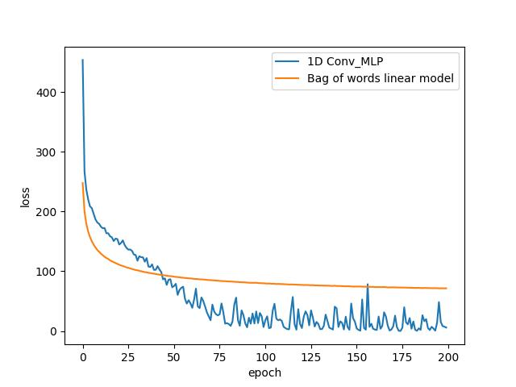
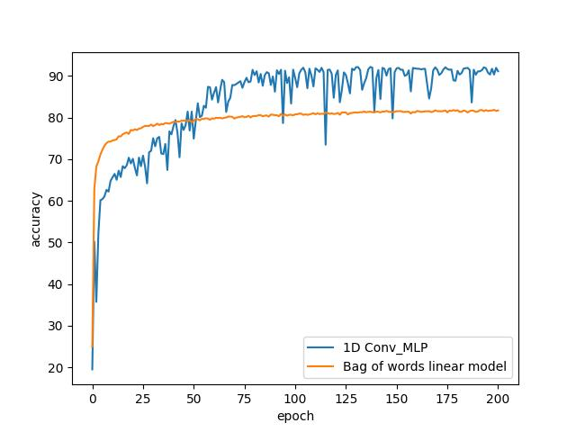

# Text Classification with MLP and Bag-of-Words Models

This project demonstrates how to perform text classification using two different models: a 1D Convolutional Multi-Layer Perceptron (MLP) and a Bag-of-Words (BoW) linear model. The example uses the Yelp reviews dataset to classify reviews into star ratings from 1 to 5.

## Table of Contents

- [Dependencies](#dependencies)
- [Data Preparation](#data-preparation)
- [Model Definitions](#model-definitions)
- [Training](#training)
- [Evaluation](#evaluation)
- [Results](#results)
- [Usage](#usage)

## Dependencies

This project requires the following Python packages:

- `pandas`
- `matplotlib`
- `numpy`
- `torch` (PyTorch)

These dependencies are specified in the `requirements.txt` file. To install them, follow these steps:

1. **Clone the Repository**:

    ```bash
    git clone <repository-url>
    cd <repository-directory>
    ```

2. **Create a Virtual Environment** (optional but recommended):

    ```bash
    python -m venv venv
    source venv/bin/activate  # On Windows use `venv\Scripts\activate`
    ```

3. **Install Dependencies**:

    ```bash
    pip install -r requirements.txt
    ```

## Data Preparation

1. **Dataset**: The dataset used is a JSON file containing Yelp reviews with associated star ratings.

2. **Loading Data**:
   - The dataset is read using `pandas` from the file `data/filtered_yelp_academic_dataset_review.json`.

3. **Text and Labels**:
   - Reviews text and their corresponding star ratings are extracted.   
   - Labels are adjusted from the range `{1,...,5}` to `{0,...,4}` for zero-based indexing.

4. **Encoding**:
   - `Text_Encoder` is used to encode the text data into numerical format suitable for input into machine learning models.
   - The vocabulary size is set to `k + 2` to account for padding and unknown tokens.

5. **Tensorization**:
   - The encoded text is padded and tensorized using `tensorize_dataset` to prepare it for model input.

## Model Definitions

Two models are used for text classification:

1. **MLP_1D**:
   - A 1D Convolutional Multi-Layer Perceptron model defined in `models.models`.

2. **Linear_Network**:
   - A Bag-of-Words linear model defined in `models.models`.

## Training

1. **Initialization**:
   - Models and `Text_Classification_Handler` instances are created for both the MLP and BoW models.
   - A training percentage of 80% and batch size of 32 are used.

2. **Training**:
   - Both models are trained for 200 epochs using the `train` method of `Text_Classification_Handler`.

## Evaluation

1. **Loss and Accuracy**:
   - The loss and accuracy of both models are tracked and plotted.
   - Plots are saved as images showing the performance of each model over epochs.

## Results

The 1D Convolutional MLP has some spikes in loss which suggests possibly using a lower learning rate. Regardless, it shows an improvement over the linear bag-of-words model. This improvement comes with the cost of significantly longer training time however.

### Loss Plot

The following image shows the training loss over epochs for both models:



### Accuracy Plot

The following image shows the training accuracy over epochs for both models:



## Usage

To run the script, follow these steps:

1. **Prepare the Environment**: Ensure all dependencies are installed as described in the [Dependencies](#dependencies) section.

2. **Run the Script**:

    ```bash
    python main.py
    ```

Make sure the `data/filtered_yelp_academic_dataset_review.json` file is correctly placed relative to the script and that the `utils` and `models` directories contain the required custom modules.

Feel free to modify parameters such as the number of epochs, batch size, or models as needed for your specific use case.

## Requirements File

The `requirements.txt` file used for this project is as follows:

```plaintext
pandas==2.2.2
matplotlib==3.9.1
numpy==1.24.1
--extra-index-url https://download.pytorch.org/whl/cu121
torch==2.3.1
